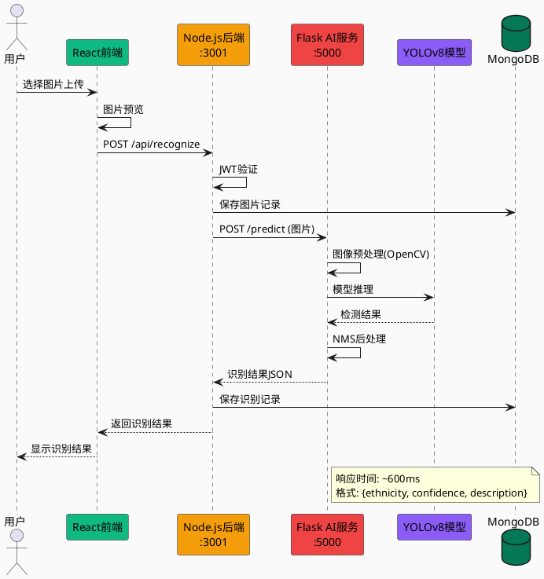

# 论文图表绘画指南

本文档提供12个论文图表的详细绘画指南，包括元素规格、颜色方案、工具推荐和具体步骤。

---

## 一、推荐工具

| 图表类型 | 推荐工具 | 备注 |
|----------|----------|------|
| 架构图/流程图 | Draw.io (免费)、Visio、Lucidchart | 支持导出高清PNG/SVG |
| UML图 | StarUML、PlantUML、Draw.io | 标准UML符号 |
| E-R图 | MySQL Workbench、Draw.io、dbdiagram.io | 数据库设计专用 |
| 数据图表 | Python Matplotlib、Excel、Origin | 训练曲线、统计数据 |
| 界面截图 | Snipaste、浏览器开发者工具 | 必须是实际系统截图 |

---

## 二、配色方案（统一风格）

```
主色调：
- 蓝色系：#3B82F6（前端/用户相关）
- 绿色系：#10B981（数据库/成功状态）
- 橙色系：#F59E0B（后端/警告）
- 红色系：#EF4444（AI服务/错误）
- 紫色系：#8B5CF6（模型相关）

辅助色：
- 深色文字：#1F2937
- 浅色文字：#6B7280
- 背景色：#F9FAFB
- 边框色：#E5E7EB
- 白色背景：#FFFFFF
```

---

## 三、各图表详细绘画指南

---

### 图2-1：YOLOv8网络结构简图

**绘画工具**：Draw.io 或 Visio

**布局结构**（从左到右）：
```
[输入图像] → [Backbone骨干网络] → [Neck颈部网络] → [Head检测头] → [输出结果]
```

**详细元素规格**：

1. **输入区域**
   - 矩形框：宽80px，高120px
   - 背景：浅灰 #F3F4F6
   - 内容：图片图标 + "640×640 RGB"
   - 边框：1px 实线 #D1D5DB

2. **Backbone区域**（紫色渐变）
   - 大矩形：宽280px，高350px
   - 圆角：12px
   - 背景：渐变 #667EEA → #764BA2
   - 标题："Backbone 骨干网络"
   - 子模块（白底半透明框）：
     - Conv层 × 3：显示 "Conv 3×3, stride=2"
     - C2f模块：高亮显示
     - SPPF模块：标注 "5×5, 9×9, 13×13"
   - 输出标注：P3(80×80), P4(40×40), P5(20×20)

3. **Neck区域**（粉红渐变）
   - 大矩形：宽200px，高350px
   - 背景：渐变 #F093FB → #F5576C
   - 子模块：
     - FPN自顶向下
     - PAN自底向上
     - Concat拼接

4. **Head区域**（蓝色渐变）
   - 大矩形：宽200px，高350px
   - 背景：渐变 #4FACFE → #00F2FE
   - 子模块：
     - 分类分支（56类）
     - 回归分支（边界框）
     - DFL分布焦点损失

5. **输出区域**
   - 矩形框：宽80px，高120px
   - 内容：检测结果图标 + "类别+置信度+边界框"

6. **连接箭头**
   - 线宽：2px
   - 颜色：#6B7280
   - 箭头样式：实心三角

**标注说明**：
- 底部添加说明文字："模型特点：端到端单阶段检测、CSPDarknet53骨干、FPN+PAN特征融合"

---

### 图2-2：系统前后端分离架构图

**绘画工具**：Draw.io

**布局结构**（左右分栏）：
```
左侧：前端层（蓝色主题）
中间：通信层
右侧：后端层 + 数据层 + AI层
```

**详细元素规格**：

1. **前端层大框**
   - 位置：左侧，宽400px，高450px
   - 边框：2px 实线 #3B82F6
   - 标题栏：蓝紫渐变背景

   内部组件：
   - React应用框：
     - 子项：TypeScript、Vite、TailwindCSS、Framer Motion
     - 每项：白底灰框，高度22px
   
   - 页面组件框：
     - 6个小方块：首页、智识、画廊、共赏、博物、缘起
     - 每个方块：70px × 28px，蓝色背景
   
   - 状态管理框：标注 "React Hooks + Context"
   - API请求框：标注 "Axios HTTP客户端"
   - 路由框：标注 "React Router v6"

2. **通信层**
   - 中间窄条：宽80px
   - 内容："REST API" + "JWT Auth"
   - 双向箭头

3. **后端层**
   - Node.js服务框：标注 Express.js、JWT认证
   - API路由框：/api/auth、/api/posts、/api/recognize
   - 端口标注：:3001

4. **数据层**
   - MongoDB框：绿色主题
   - 内容：Mongoose ODM、collections列表
   - 端口：:27017

5. **AI服务层**
   - Flask框：红/橙色主题
   - 内容：YOLOv8、OpenCV
   - 端口：:5000

**连接线**：
- 实线箭头：同步请求
- 虚线箭头：异步返回
- 标注端口号

---

### 图3-1：系统核心功能用例图

**绘画工具**：StarUML 或 Draw.io（使用UML模板）

**标准UML元素**：

1. **参与者（Actor）**
   - 符号：小人图标
   - 数量：3个
   - 名称：游客、注册用户、管理员、AI系统
   - 位置：系统框左侧

2. **系统边界**
   - 大矩形框：虚线边框
   - 名称："云矜ku民族服饰文化平台"

3. **用例（椭圆）**
   - 每个用例：椭圆形状，宽90px，高35px
   - 分组排列：

   认证模块：
   - 用户注册/登录
   - 邮箱验证
   - 密码重置

   智能识别模块：
   - 上传图片
   - 智能识别服饰
   - 查看识别结果
   - 文化知识解读

   画廊模块：
   - 浏览画廊
   - 按民族筛选
   - 查看大图

   社区模块：
   - 发布帖子
   - 点赞/评论
   - 收藏内容
   - 关注用户

   后台管理：
   - 内容审核
   - 用户管理
   - 数据统计

4. **关联线**
   - 参与者到用例：实线连接
   - 用例间关系：
     - <<extend>>：虚线箭头（识别→AI服务）
     - <<include>>：虚线箭头

**颜色建议**：
- 不同模块用不同浅色背景区分
- 认证：蓝色
- 识别：橙色
- 画廊：绿色
- 社区：粉色
- 管理：红色

---

### 图3-2：系统总体技术架构与部署图

**绘画工具**：Draw.io

**布局结构**：
```
顶部：用户终端
中间：阿里云ECS（大虚线框）
  - Nginx
  - Node.js
  - MongoDB
  - Flask AI
底部：技术栈说明
```

**详细元素规格**：

1. **云环境边界**
   - 大虚线框：宽900px，高500px
   - 边框：橙色虚线，stroke-dasharray: 10,5
   - 标注："☁️ 阿里云ECS服务器 (47.110.125.139)"
   - 背景：浅橙渐变，透明度30%

2. **用户终端**
   - 位置：左上角
   - 内容：PC浏览器、移动端图标
   - 标注："JWT Token认证"

3. **Nginx反向代理**
   - 绿色主题框
   - 宽140px，高180px
   - 子项：
     - 静态资源服务 (/dist/*)
     - API代理转发 (/api/* → :3001)
     - SSL证书

4. **Node.js后端**
   - 绿色主题框
   - 宽160px，高180px
   - 子项：
     - Express.js框架
     - JWT身份认证
     - RESTful API
     - Multer文件上传
   - 标注："PM2进程管理 Port:3001"

5. **MongoDB数据库**
   - 深绿色主题
   - 宽180px，高100px
   - 内容：Mongoose ODM、collections

6. **Flask AI服务**
   - 蓝色主题
   - 宽180px，高180px
   - 子项：
     - YOLOv8模型推理
     - OpenCV预处理
   - 标注："Port:5000"

7. **文件存储**
   - 橙色主题
   - 内容：/uploads/* 本地存储

**连接箭头**：
- HTTPS → Nginx (443)
- Nginx → Node.js (3001)
- Node.js → MongoDB (27017)
- Node.js → Flask (5000)
- 标注每条连接的协议/端口

---

### 图4-1：民族服饰数据采集与预处理流程图

**绘画工具**：Draw.io 或 Visio

**布局结构**（从左到右的流程）：
```
[数据采集] → [数据清洗] → [数据标注] → [数据增强] → [数据集划分]
                                                    ↓
                                               [输出结果]
```

**详细元素规格**：

1. **阶段1：数据采集**
   - 宽170px，高220px
   - 蓝紫渐变背景
   - 标题："1. 数据采集"
   - 子项（白底框）：
     - 网络爬虫采集
     - 公开数据集下载
     - 用户上传贡献
   - 统计框："数据来源：56个民族图片库"

2. **阶段2：数据清洗**
   - 粉红渐变背景
   - 标题："2. 数据清洗"
   - 子项：
     - 去除重复图片
     - 删除损坏文件
     - 过滤低质量图片
   - 标准："分辨率≥640×480"

3. **阶段3：数据标注**
   - 蓝色渐变背景
   - 标题："3. 数据标注"
   - 子项：
     - 民族类别标注
     - 边界框标注
     - 特征标签标注
   - 格式："YOLO格式 (.txt)"

4. **阶段4：数据增强**
   - 绿色渐变背景
   - 标题："4. 数据增强"
   - 子项：
     - 随机旋转翻转
     - 色彩变换调整
     - 缩放裁剪处理
     - Mosaic增强
   - 倍数："增强倍数: 3-5倍"

5. **阶段5：数据集划分**
   - 橙黄渐变背景
   - 三个并列框：
     - 训练集70%（黄色）
     - 验证集15%（蓝色）
     - 测试集15%（粉色）
   - 统计："总图片数: 8000+张"

6. **输出结果框**
   - 绿色主题
   - 内容：
     - 清洗后的高质量数据集
     - 标准化标注文件
     - 数据质量保证

**箭头规格**：
- 实线箭头连接各阶段
- 颜色与前一阶段一致

---

### 图4-2：系统核心数据库E-R图

**绘画工具**：Draw.io 或 dbdiagram.io

**实体规格**（每个实体框）：

1. **User（用户）**
   - 矩形：宽180px，高220px
   - 标题栏：蓝色 #3B82F6
   - 字段：
     ```
     🔑 _id: ObjectId
     username: String
     email: String
     password: String
     avatar: String
     bio: String
     isVerified: Boolean
     verificationToken: String
     resetPasswordToken: String
     timestamps
     ```

2. **Post（帖子）**
   - 标题栏：绿色 #10B981
   - 字段：
     ```
     🔑 _id: ObjectId
     🔗 author: ObjectId (→User)
     description: String
     mediaType: String
     mediaUrls: [String]
     coverUrl: String
     tags: [String]
     topics: [String]
     stats: Object
     timestamps
     ```

3. **Comment（评论）**
   - 标题栏：橙色 #F59E0B
   - 字段：
     ```
     🔑 _id: ObjectId
     🔗 post: ObjectId (→Post)
     🔗 author: ObjectId (→User)
     content: String
     🔗 parentComment: ObjectId
     likeCount: Number
     timestamps
     ```

4. **Collection（收藏）**
   - 标题栏：紫色 #8B5CF6

5. **Follow（关注）**
   - 标题栏：粉色 #EC4899

6. **Like（点赞）**
   - 标题栏：红色 #EF4444

**关系线规格**：
- 主键：🔑 标记
- 外键：🔗 标记
- 关系类型：
  - 1:N → 实线，标注"1"和"N"
  - N:M → 实线，两端都标注"N"

**图例**：
- 右下角添加图例框
- 说明颜色含义和符号

---

### 图4-3：YOLOv8模型训练损失-准确率曲线

**绘画工具**：Python Matplotlib 或 Excel

**Python代码示例**：

```python
import matplotlib.pyplot as plt
import numpy as np

# 设置中文字体
plt.rcParams['font.sans-serif'] = ['SimHei']
plt.rcParams['axes.unicode_minus'] = False

# 模拟数据
epochs = np.arange(0, 101)

# 损失曲线（逐渐下降）
train_loss = 1.0 * np.exp(-0.03 * epochs) + 0.1 + np.random.normal(0, 0.02, 101)
val_loss = 1.1 * np.exp(-0.025 * epochs) + 0.12 + np.random.normal(0, 0.03, 101)

# 准确率曲线（逐渐上升）
map50 = 0.3 + 0.6 * (1 - np.exp(-0.05 * epochs)) + np.random.normal(0, 0.01, 101)
map50_95 = 0.2 + 0.55 * (1 - np.exp(-0.04 * epochs)) + np.random.normal(0, 0.01, 101)

# 创建图表
fig, (ax1, ax2) = plt.subplots(1, 2, figsize=(14, 5))

# 左图：损失曲线
ax1.plot(epochs, train_loss, 'b-', linewidth=2, label='训练损失')
ax1.plot(epochs, val_loss, 'orange', linewidth=2, label='验证损失')
ax1.set_xlabel('Epoch', fontsize=12)
ax1.set_ylabel('Loss', fontsize=12)
ax1.set_title('损失曲线 (Loss Curves)', fontsize=14)
ax1.legend(loc='upper right')
ax1.grid(True, alpha=0.3)
ax1.set_xlim(0, 100)
ax1.set_ylim(0, 1.2)

# 右图：准确率曲线
ax2.plot(epochs, map50, 'g-', linewidth=2, label='mAP@50')
ax2.plot(epochs, map50_95, 'purple', linewidth=2, label='mAP@50-95')
ax2.set_xlabel('Epoch', fontsize=12)
ax2.set_ylabel('mAP', fontsize=12)
ax2.set_title('准确率曲线 (Accuracy Curves)', fontsize=14)
ax2.legend(loc='lower right')
ax2.grid(True, alpha=0.3)
ax2.set_xlim(0, 100)
ax2.set_ylim(0, 1.0)

plt.tight_layout()
plt.savefig('图4-3_训练曲线.png', dpi=300, bbox_inches='tight')
plt.show()
```

**图表规格**：
- 尺寸：宽14英寸 × 高5英寸
- DPI：300
- 字体：SimHei（黑体）
- 线宽：2px
- 颜色：
  - 训练损失：蓝色 #3B82F6
  - 验证损失：橙色 #F59E0B
  - mAP@50：绿色 #10B981
  - mAP@50-95：紫色 #8B5CF6

**底部统计信息框**：
- 训练参数：Epochs=100, Batch=16, 图像尺寸=640×640
- 数据集：训练集70%，验证集15%，测试集15%
- 最终结果：mAP@50=91.8%, mAP@50-95=78.5%

---

### 图4-4：智能识别服务API调用序列图

**绘画工具**：PlantUML 或 Draw.io

**PlantUML代码示例**：



**手动绘制规格**：

1. **参与者（顶部矩形）**
   - 用户：小人图标，宽80px
   - React前端：绿色，宽100px
   - Node.js后端：橙色，宽100px，标注端口
   - Flask AI：红色，宽100px，标注端口
   - YOLOv8模型：紫色，宽100px
   - MongoDB：深绿色，宽60px

2. **生命线**
   - 垂直虚线，从参与者向下延伸
   - 高度：根据消息数量

3. **消息（水平箭头）**
   - 同步消息：实线 + 实心箭头
   - 返回消息：虚线 + 空心箭头
   - 编号：1, 2, 3...

4. **激活框**
   - 在生命线上添加细长矩形
   - 表示处理时间

---

### 图4-5：用户发布帖子业务逻辑流程图

**绘画工具**：Draw.io（使用流程图模板）

**标准流程图符号**：

1. **开始/结束**：圆角椭圆
   - 颜色：绿色渐变（开始）、红色渐变（结束）
   - 文字："开始"、"发布成功"

2. **处理步骤**：矩形
   - 颜色：蓝色渐变
   - 圆角：5px
   - 高度：35px

3. **判断条件**：菱形
   - 颜色：橙色渐变
   - 文字："已登录?"、"验证通过?"

4. **数据操作**：平行四边形
   - 颜色：紫色渐变
   - 用于：保存数据库操作

**流程步骤**：
```
开始
  ↓
点击发布按钮 [矩形]
  ↓
已登录? [菱形] → 否 → 跳转登录页
  ↓ 是
填写帖子内容 [矩形]
  ↓
添加标签话题 [矩形]
  ↓
前端提交表单 [矩形]
  ↓
数据验证通过? [菱形] → 否 → 返回错误信息
  ↓ 是
保存帖子到MongoDB [平行四边形]
  ↓
更新Feed流 [矩形]
  ↓
发布成功 [椭圆]
```

**图例框**：
- 位置：左下角
- 内容：各符号的含义

---

### 图4-6：平台主要界面截图集

**⚠️ 重要：必须使用实际系统截图**

**截图方法**：
1. 访问 http://47.110.125.139
2. 使用浏览器全屏模式（F11）
3. 使用 Snipaste 或 Windows截图工具
4. 分辨率：1920×1080

**需要截取的页面**：

1. **首页**
   - URL: `/`
   - 截取内容：完整页面，包含导航栏、英雄区、功能卡片
   - 标注：关键功能区域

2. **智能识别页**
   - URL: `/recognition`
   - 截取内容：上传区域、识别结果示例
   - 可选：上传一张测试图片，截取识别结果

3. **锦绣画廊页**
   - URL: `/gallery`
   - 截取内容：瀑布流图片展示、民族分类筛选

4. **文化共赏社区页**
   - URL: `/share`
   - 截取内容：帖子列表、互动按钮

**排版建议**：
- 四张截图排列成2×2网格
- 每张截图下方添加标题
- 可添加序号标注（1、2、3、4）
- 整体添加外框和标题："云矜ku平台主要界面截图集"

---

### 图5-1：模型识别效果案例对比图

**⚠️ 重要：必须使用实际识别截图**

**制作步骤**：

1. **准备原图**
   - 来源：`6大民族详细图片/` 目录
   - 选择3个民族：苗族、藏族、维吾尔族
   - 尺寸：统一调整为 640×480

2. **获取识别结果**
   - 在线系统：http://47.110.125.139/recognition
   - 上传图片，截取识别结果界面
   - 确保：民族名称、置信度、文化解读都可见

3. **对比排版**
   ```
   案例一：苗族服饰
   [原图 300px] → [识别结果 350px]
   
   案例二：藏族服饰
   [原图 300px] → [识别结果 350px]
   
   案例三：维吾尔族服饰
   [原图 300px] → [识别结果 350px]
   ```

4. **添加标注**
   - 原图标注：民族名称
   - 结果标注：置信度高亮（如94.5%）
   - 箭头：从原图指向结果

**右侧统计面板**：
- 平均识别准确率：91.8%
- 支持民族类别：56类
- 平均响应时间：850ms

---

### 图5-2：平台上线初期关键数据统计图

**绘画工具**：Python Matplotlib 或 Excel

**⚠️ 重要：数据必须来源于实际项目**

**数据获取方法**：

```javascript
// MongoDB查询用户数
db.users.countDocuments()

// 查询帖子数
db.posts.countDocuments()

// 查询识别记录数
db.recognitions.countDocuments()
```

**Python代码示例**：

```python
import matplotlib.pyplot as plt
import numpy as np

plt.rcParams['font.sans-serif'] = ['SimHei']

# 数据
categories = ['累计访问\n用户数', '识别调用\n次数', '用户生成\n内容数', '注册用户数']
values = [4280, 3650, 1520, 856]
colors = ['#3B82F6', '#10B981', '#EF4444', '#8B5CF6']

# 柱状图
fig, ax = plt.subplots(figsize=(10, 6))
bars = ax.bar(categories, values, color=colors, width=0.6)

# 添加数值标签
for bar, val in zip(bars, values):
    ax.text(bar.get_x() + bar.get_width()/2, bar.get_height() + 100, 
            str(val), ha='center', fontsize=12, fontweight='bold')

ax.set_ylabel('数量', fontsize=12)
ax.set_title('平台上线初期关键数据统计图', fontsize=14)
ax.set_ylim(0, 5000)
ax.grid(axis='y', alpha=0.3)

plt.tight_layout()
plt.savefig('图5-2_数据统计图.png', dpi=300)
```

**图表内容**：

1. **柱状图**（左）
   - X轴：累计访问用户数、识别调用次数、UGC内容数、注册用户数
   - Y轴：数量（0-5000）
   - 颜色：蓝、绿、红、紫

2. **折线图**（右）
   - X轴：月份（1月-5月）
   - Y轴：数量
   - 三条线：访问用户、识别调用、UGC内容
   - 标注：增长趋势

3. **底部统计卡片**
   - 日均访问量：142人次
   - 识别成功率：91.8%
   - 用户留存率：68.5%
   - 人均互动：4.2次

---

## 四、导出规格

| 用途 | 格式 | DPI | 尺寸 |
|------|------|-----|------|
| 论文正文 | PNG/JPG | 300 | 宽度≤16cm |
| 打印 | PDF | 300 | 原始尺寸 |
| 矢量编辑 | SVG | - | 原始尺寸 |

**Word插入建议**：
- 图片居中
- 图题在图片下方，格式："图X-X 图表名称"
- 字体：宋体，五号
- 段后间距：0.5行

---

## 五、检查清单

- [ ] 所有图表风格统一
- [ ] 字体大小一致（正文10-12pt，标题14-16pt）
- [ ] 颜色方案一致
- [ ] 图题编号正确
- [ ] 界面截图清晰（实际系统）
- [ ] 数据来源真实
- [ ] 导出分辨率足够（300DPI）
